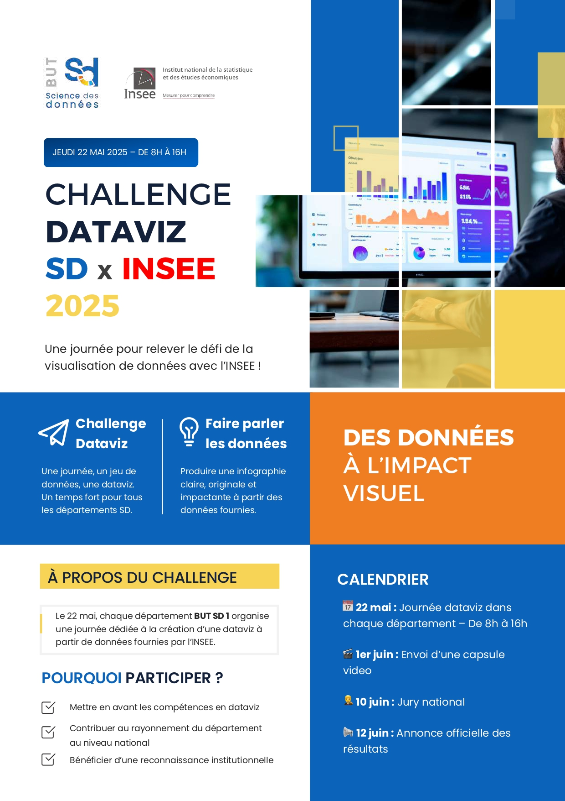
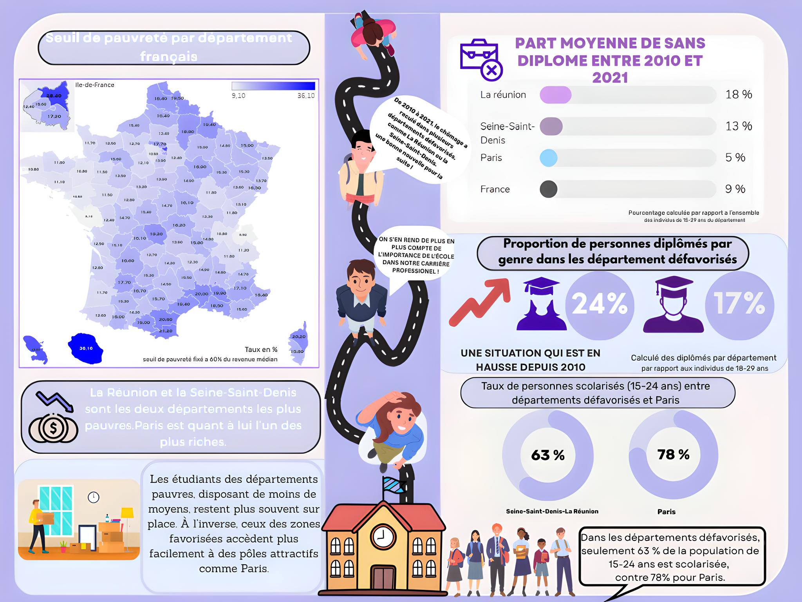

# 📊 Analyse des inégalités économiques et de leurs impacts sur les parcours scolaires et professionnels en France


## Présentation du projet

Équipe : 5 étudiants
Durée : 1 journée (8h – 17h)
Note obtenue : 16/20

Le concours Dataviz est un événement national réunissant l'ensemble des étudiants de première année de BUT Science des Données en France.

Pour l'édition 2024-2025, le concours était organisé en partenariat avec l'INSEE. Les participants disposaient d'une seule journée pour analyser un jeu de données, construire une problématique, produire des visualisations pertinentes et concevoir une infographie répondant à cette problématique.

Ce projet avait pour objectif d'explorer les liens entre les inégalités économiques territoriales et les parcours scolaires et professionnels des habitants en France entre 2010 et 2021.
Nous avons travaillé à partir de données publiques afin de produire des analyses visuelles et des indicateurs permettant de mieux comprendre les disparités observées entre les départements français.

Chaque groupe devait ensuite présenter son travail lors d'une soutenance afin de sélectionner le projet qui représenterait l'IUT au niveau national.

---

## Problématique

> **Comment les inégalités économiques entre les départements français ont-elles influencé les parcours scolaires et professionnels des habitants entre 2010 et 2021 ?**

L'objectif était d'identifier d'éventuelles relations entre le niveau de précarité économique d'un territoire et les indicateurs liés à l'éducation ou à l'insertion professionnelle.

---

## Mon rôle dans le projet

J'ai assuré un rôle de coordinateur/manager au sein de l'équipe de cinq personnes.

Mes missions principales étaient :

* organiser et répartir les tâches entre les membres du groupe ;
* assurer le suivi de l'avancement du projet ;
* accompagner les membres de l'équipe lorsqu'ils rencontraient des difficultés ;
* participer au nettoyage et à la préparation des données ;
* contribuer à l'analyse et à l'interprétation des résultats.

Cette expérience m'a permis de développer des compétences en gestion de projet collaboratif dans un contexte proche du fonctionnement d'une équipe en entreprise.

---

## Technologies utilisées

* Excel
* Tableau
* Données ouvertes (Open Data)
* Analyse statistique descriptive
* Datavisualisation

---

## Préparation des données

Avant toute analyse, les données brutes ont été nettoyées afin de garantir leur qualité :

* suppression des incohérences ;
* harmonisation des variables ;
* vérification des valeurs manquantes ;
* préparation des jeux de données pour Tableau.

Cette étape a permis d'obtenir une base fiable pour les analyses et les visualisations.

---

## 📈 Analyses réalisées

Afin de répondre à la problématique, nous avons étudié plusieurs indicateurs :

* taux de pauvreté par département ;
* niveau de scolarisation ;
* parcours éducatifs ;
* insertion professionnelle ;
* disparités territoriales.

Nous avons ensuite croisé ces informations afin d'identifier d'éventuelles corrélations entre contexte économique et trajectoires scolaires ou professionnelles.

---

## Datavisualisations réalisées

Plusieurs visualisations interactives ont été développées avec Tableau.

### Carte du taux de pauvreté en France

Une carte choroplèthe a été réalisée afin de représenter la proportion de ménages vivant sous le seuil de pauvreté dans chaque département français.

> Ajouter ici une capture d'écran de la carte Tableau.

```text
/images/carte-pauvrete-france.png
```

### Indicateurs clés

Nous avons également construit plusieurs indicateurs permettant de mettre en évidence :

* les écarts de réussite scolaire selon les territoires ;
* les différences d'accès aux études ;
* les inégalités observées entre départements favorisés et défavorisés.

Ces analyses ont montré que certains territoires économiquement fragiles présentent également des écarts significatifs en matière de scolarisation et de parcours professionnels.

---

## Présentation finale

Le projet s'est conclu par une présentation devant un jury et l'ensemble de la promotion.

Nous avons présenté :

* la problématique étudiée ;
* notre méthodologie ;
* les visualisations produites ;
* les principaux résultats ;
* les limites de l'étude.

Cette restitution a démontré notre capacité à synthétiser des données complexes et à les valoriser visuellement auprès d'un public.

---

## Compétences développées

Ce projet m'a permis de renforcer plusieurs compétences essentielles.

### Gestion de projet

* Coordination d'une équipe.
* Répartition des tâches.
* Suivi de l'avancement du projet.
* Travail collaboratif.

### Analyse de données

* Compréhension et exploration de bases de données.
* Construction d'une problématique pertinente.
* Interprétation de résultats statistiques.

### Datavisualisation

* Création de cartes interactives.
* Construction d'indicateurs visuels.
* Storytelling autour des données.

### Communication

* Présentation orale.
* Vulgarisation de résultats complexes.
* Mise en valeur des analyses.

---

##  Axes d'amélioration

Pour poursuivre ma progression, je souhaite :

* approfondir mes compétences sur Tableau ;
* développer mes connaissances en storytelling visuel ;
* apprendre à concevoir des infographies plus avancées ;
* améliorer ma gestion de projet dans des contextes contraints en temps ;
* renforcer mes capacités de prise de parole et de valorisation des résultats à l'oral.

---


---

##  Résultat

Ce projet m'a permis d'acquérir une expérience concrète dans la conduite d'une étude basée sur les données :

**Nettoyage → Analyse → Datavisualisation → Storytelling → Présentation**

Il illustre ma capacité à travailler en équipe, à coordonner un projet d'analyse de données et à transformer des données complexes en informations compréhensibles et exploitables.
